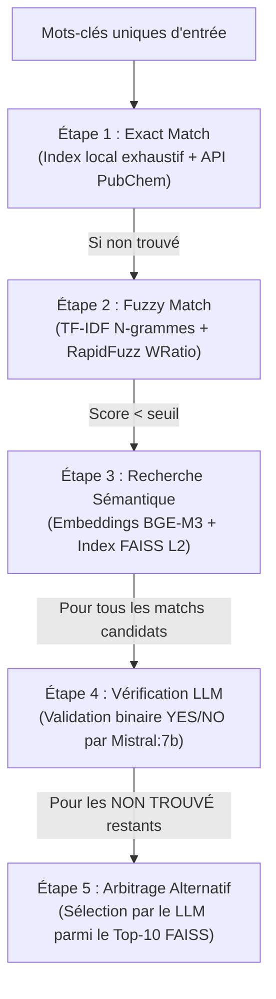

# Cat.VocMapX
Alignement Multi-Étapes de Mots-Clés Scientifiques

Ce projet est une pipeline robuste de traitement automatique du langage naturel (TALN) et d'alignement terminologique. 
Il permet de mapper une liste de mots-clés scientifiques uniques avec plusieurs référentiels et thésaurus contrôlés (locaux ou distants) en combinant des approches exactes, floues, sémantiques, et une validation par modèle de langage (LLM local via Ollama).

## Fonctionnalités principales
* Indexation multi-formats : Support natif du parsing de vocabulaires complexes (.rdf, .owl, .nt, .nq, .xml, .sdf).
* Stratégie d'alignement hybride en 5 étapes (Détails ci-dessous).
* Parallélisation et optimisation RAM : Traitement multi-processus adapté pour macOS (compatibilité spawn) et Windows/Linux.
* Gestion dynamique de la taille des batchs selon la mémoire disponible.Validation par LLM Local : Double intégration d'Ollama (mistral:7b) pour la validation des correspondances et l'arbitrage des cas complexes.
* Rapports analytiques complets : Génération automatisée de fichiers Excel contenant des statistiques croisées et des mises en forme conditionnelles (scores, verdicts LLM).

## Architecture de l'alignement (5 Étapes)
La pipeline traite les mots-clés de manière séquentielle pour maximiser la précision tout en minimisant le coût de calcul : 

   

1. Exact Match (Étape 1) : Correspondance stricte (case insensitive) avec l'index local ou via l'API REST de PubChem.
2. Fuzzy Match (Étape 2) : Pré-filtrage par similarité cosinus sur n-grammes de caractères (TF-IDF), suivi d'un calcul de score flou via Rapidfuzz.fuzz.WRatio.
3. Recherche Sémantique (Étape 3) : Encodage vectoriel des concepts via le modèle bi-encodeur multilingue BAAI/bge-m3 et recherche de voisins proches à l'aide d'un index FAISS avec normalisation L2.
4. Vérification LLM (Étape 4) : Soumission de chaque paire candidat/mot-clé trouvée à un modèle mistral:7b local pour obtenir un verdict de validation, un niveau de confiance et une justification textuelle.
5. LLM sur Non Trouvés (Étape 5) : Pour les mots-clés n'ayant franchi aucun seuil, le LLM analyse le Top-10 des candidats sémantiques FAISS pour déterminer si l'un d'eux est acceptable.

## Référentiels supportés
Le script est configuré pour ingérer et unifier les structures des vocabulaires suivants (à placer dans le dossier Vocabulaires/) :
* Sciences Chimiques / Médicales : PubChem (API), MeSH (NQ), ChEBI (SDF).
* Sciences Agronomiques et Environnementales : AGROVOC (NT), NALT (RDF), GEMET (RDF), ENVO (OWL), PO (OWL).
* Généralistes / Institutionnels : EUROVOC (RDF), UNESCO Soil (RDF), PACTOLS (Lieux/Sujets RDF), EDAM (Main/Imaging RDF), Goldbook (XML).

## Prérequis et Installation
1. Cloner le dépôt et installer les dépendances
   git clone [https://github.com/FCL-DataIA/Cat.VocMapX.git](https://github.com/FCL-DataIA/Cat.VocMapX.git)
   cd Cat.VocMapX
   pip install -r requirements.txt

Dépendances clés : pandas, torch, sentence-transformers, faiss-cpu, rapidfuzz, scikit-learn, openpyxl, tqdm, psutil.2. 

2. Configuration d'Ollama (Pour les étapes 4 & 5)
   * Téléchargez et installez Ollama depuis ollama.com.
   * Lancez le service et téléchargez le modèle :
       ollama serve
       ollama pull mistral:7b

3. Structure des dossiers requise
   Avant de lancer le script, assurez-vous d'avoir l'arborescence suivante
voc-mapx/
┃ Cat.VocMapX.py
┃ liste_mots_cles_uniques.csv      # Votre fichier d'entrée (Doit contenir une colonne 'keyword')
┗ Vocabulaires/                    # Placez ici vos fichiers de thésaurus (ex: BLH.rdf, envo.owl...)

## Utilisation
Exécutez le script principal :
  python Cat.VocMapX.py

## Déroulement interactif
Le script demande si vous souhaitez mettre à jour l'index local (si un cache thesaurus_index.pkl existe déjà).
Il vous proposera ensuite de réutiliser les résultats de l'API PubChem pour éviter les requêtes HTTP redondantes.

## Fichiers de sortie
La pipeline génère trois livrables majeurs à la racine du projet :
1. Alignement_3etapes_complet.csv : Le fichier final d'alignement (séparateur ;) contenant toutes les correspondances, les identifiants uniques (URI), les scores de distance, ainsi que les colonnes enrichies par le LLM (LLM_Verdict, LLM5_Label, etc.).
2. Rapport_verification_llm.xlsx : Rapport Excel complet de l'étape 4 (Feuilles : Résumé, Résumé par étape, Détail mot-clé par mot-clé colorisé selon le verdict).
3. Rapport_llm_non_trouves.xlsx : Rapport Excel détaillé de l'étape 5 se focalisant uniquement sur les suggestions validées par arbitrage du LLM pour les termes complexes.
4. statistiques_vocabulaires_seuils.xlsx : Matrice statistique croisée indiquant le nombre de termes trouvés par vocabulaire source en fonction des différents seuils paramétrés (Fuzzy : 100 à 95 | Sémantique : 0.3 à 0.8).
